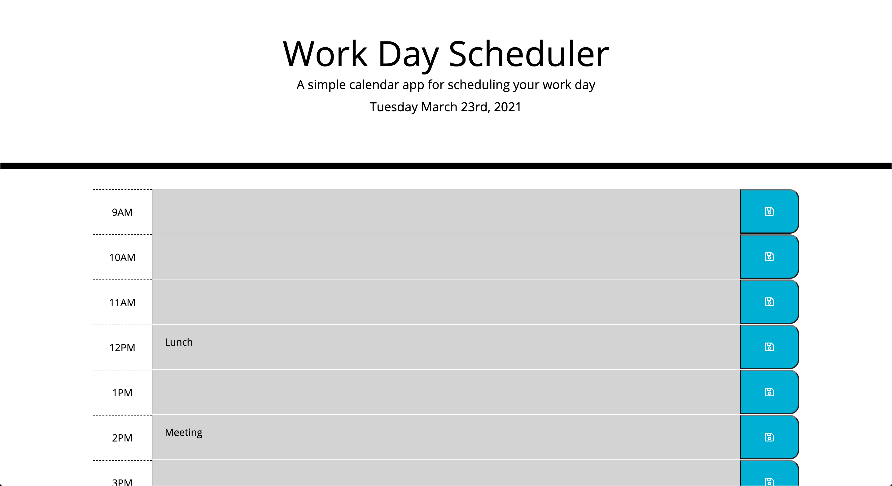
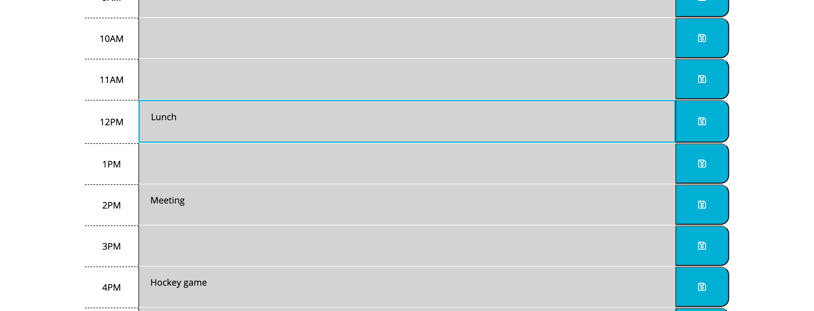
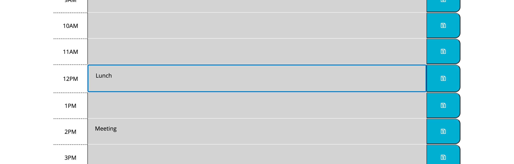

# daily-work-schedule

https://rjpotere.github.io/daily-work-schedule/

This application allows the user to input their busy schedule which will save to local storage. This will allow the user to refresh the screen and their schedule will re-load on the screen.

When hover the text area it displays a border so the user knows they can click in the text box.

when you select a text area, the box comes into focus so the user knows which hour they are currently typing in. 

